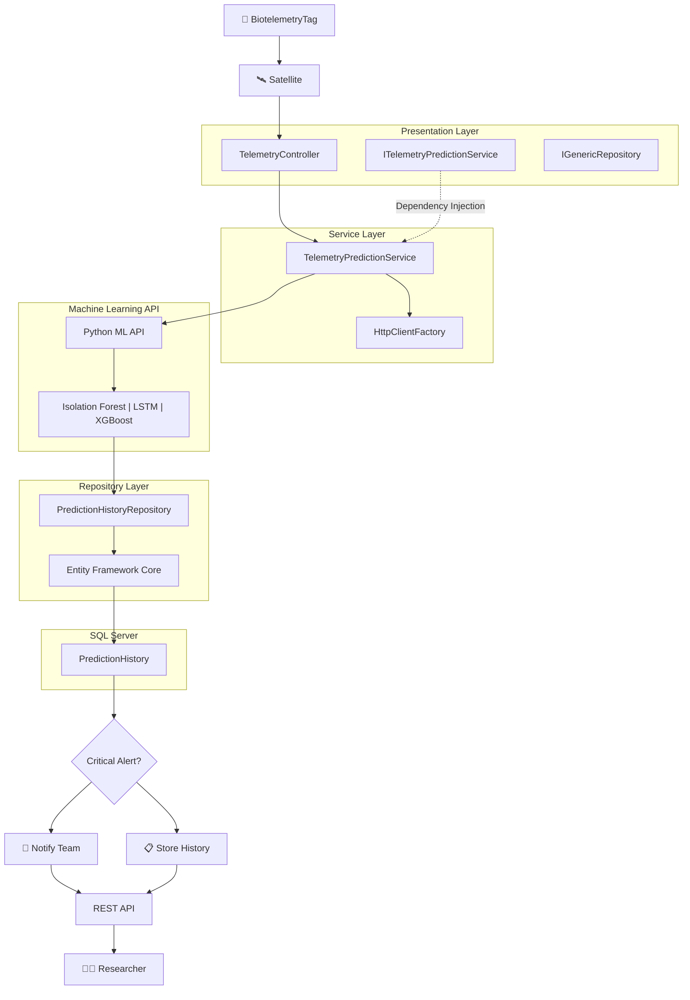

# 🏗️ Arquitetura da Solução

A arquitetura foi construída seguindo princípios de:

- SOA (Service-Oriented Architecture)
- WebServices
- Repository Pattern
- Dependency Injection
- Programação Orientada a Objetos
- RESTful APIs

## Diagrama de Arquitetura

