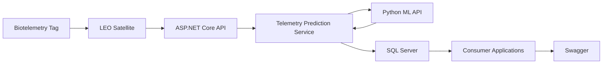
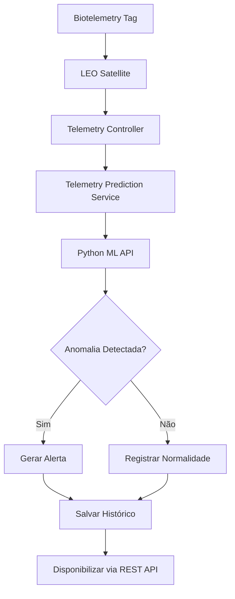
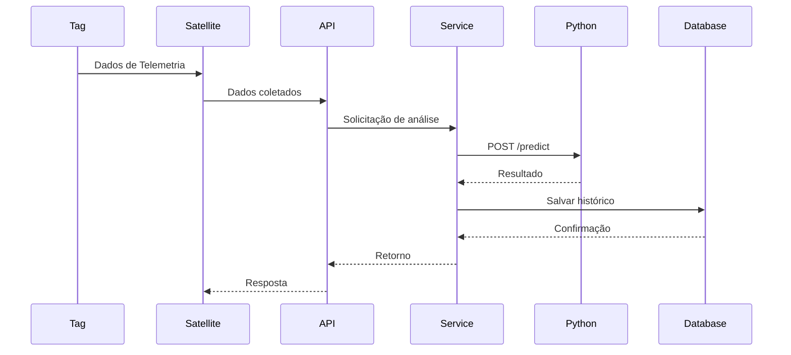
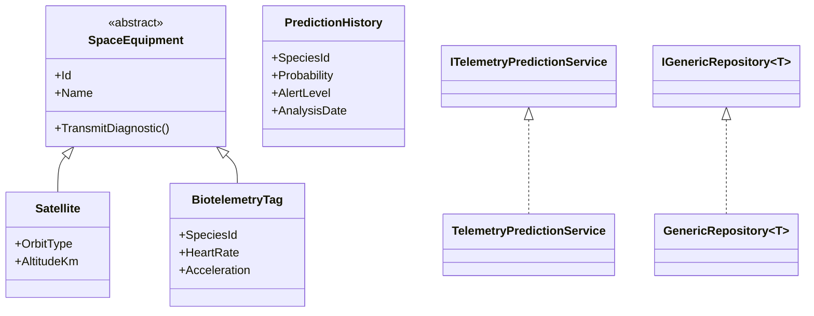

<p align="center">


</p>

<h1 align="center">🛰️ Space Telemetry</h1>

<p align="center">
<b>Monitoramento Inteligente de Fauna por Telemetria Espacial e Inteligência Artificial</b>
</p>

<p align="center">
Sistema distribuído desenvolvido para monitoramento ambiental através de biotelemetria, satélites de baixa órbita (LEO), Machine Learning e análise preditiva em tempo real.
</p>

---

# 👥 Integrantes

| Nome | RM |
|--------|--------|
| Ana Laura Torres Loureiro | RM554375 |
| Murilo Cordeiro Ferreira | RM556727 |
| Geronimo Augusto Nascimento Santos | RM557170 |
| Ianny Raquel Ferreira De Souza | RM559096 |

---

# 🌎 Sobre o Projeto

O **Space Telemetry** é uma solução criada para auxiliar pesquisadores, órgãos ambientais e instituições científicas na preservação da biodiversidade.

A proposta utiliza dispositivos de biotelemetria instalados em animais monitorados que transmitem informações fisiológicas e geográficas para satélites de baixa órbita (LEO).

Os dados são processados por uma API ASP.NET Core integrada a um serviço de Machine Learning desenvolvido em Python, capaz de detectar anomalias comportamentais e prever possíveis eventos ambientais de risco.

Todas as análises são armazenadas em SQL Server, permitindo rastreabilidade, auditoria e histórico completo das ocorrências.

---

# ⭐ Diferenciais

- Arquitetura baseada em SOA (Service Oriented Architecture)
- Comunicação entre microsserviços via REST
- Machine Learning para detecção de anomalias
- Persistência de histórico para auditoria
- Repository Pattern
- Injeção de Dependência
- DTOs para desacoplamento
- Tratamento centralizado de exceções
- Aplicação dos pilares da POO
- Integração ASP.NET Core + Python

---

# 🎯 Objetivos

| Objetivo | Descrição |
|-----------|-----------|
| 🛰️ Monitoramento | Receber dados de telemetria em tempo real |
| 🤖 Inteligência Artificial | Detectar comportamentos anômalos |
| 🚨 Alertas Preventivos | Antecipar eventos ambientais críticos |
| 📊 Histórico | Armazenar análises para pesquisas futuras |
| 🌎 Sustentabilidade | Apoiar ações de preservação da biodiversidade |

---

# 🏗️ Arquitetura da Solução



---

# 🔄 Fluxo Operacional



---

# 🔁 Sequência de Comunicação



---

# 🧩 Diagrama de Classes



---

# 🛠 Stack Tecnológica

| Camada | Tecnologia |
|----------|------------|
| Backend | ASP.NET Core 8 |
| Linguagem Principal | C# |
| Machine Learning | Python |
| Framework IA | FastAPI |
| Banco de Dados | SQL Server |
| ORM | Entity Framework Core |
| Documentação | Swagger |
| Arquitetura | SOA |
| Padrões | Repository Pattern, DTO, Dependency Injection |

---

# 🚀 Tecnologias Utilizadas

### Backend

- ASP.NET Core 8
- C#
- Swagger/OpenAPI

### Banco de Dados

- SQL Server
- Entity Framework Core

### Inteligência Artificial

- Python
- FastAPI
- Isolation Forest
- LSTM
- XGBoost

---

# 🧠 Conceitos de POO Aplicados

## Encapsulamento

Os atributos das entidades são protegidos e acessados através de propriedades e DTOs.

## Herança

A classe abstrata `SpaceEquipment` é utilizada como base para `Satellite` e `BiotelemetryTag`.

## Polimorfismo

O método `TransmitDiagnostic()` possui comportamentos distintos para cada equipamento.

## Abstração

A classe base define comportamentos comuns enquanto as subclasses implementam suas particularidades.

---

# 🔌 Interfaces

### IGenericRepository<T>

Responsável pelas operações genéricas de persistência.

### ITelemetryPredictionService

Responsável pela comunicação com o serviço de Machine Learning e gerenciamento das análises.

---

# 💉 Injeção de Dependência

```csharp
builder.Services.AddScoped(
    typeof(IGenericRepository<>),
    typeof(GenericRepository<>)
);

builder.Services.AddScoped<
    ITelemetryPredictionService,
    TelemetryPredictionService
>();

builder.Services.AddHttpClient();
```

---

# 📦 DTOs

| DTO | Tipo |
|---------|---------|
| TelemetryDTO | Request |
| SatelliteDTO | Request |
| BiotelemetryTagDTO | Request |
| SpaceEquipmentDTO | Request/Response |
| PredictionResponseDTO | Response |

---

# 🗄️ Estrutura do Banco

## PredictionHistory

Armazena:

- Espécie monitorada
- Coordenadas geográficas
- Frequência cardíaca
- Aceleração
- Probabilidade da anomalia
- Tipo de alerta
- Data da análise

## SpaceEquipment

Tabela base contendo:

- Satellite
- BiotelemetryTag

Utilizando estratégia TPH (Table Per Hierarchy).

---

# 🛡️ Tratamento de Exceções

A exceção customizada:

```csharp
SpaceTelemetryException
```

centraliza erros relacionados a:

- Comunicação com API Python
- Falhas de processamento
- Erros de integração
- Exceções não tratadas

---

# 🔗 Endpoints

## POST /api/telemetry/predict

Recebe dados de telemetria e retorna uma análise preditiva.

### Exemplo

```json
{
  "speciesId": "ANIMAL-001",
  "latitude": -23.5505,
  "longitude": -46.6333,
  "acceleration": 8.5,
  "heartRate": 120
}
```

---

## GET /api/telemetry/predictions

Retorna o histórico completo de análises realizadas.

---

# 📂 Estrutura do Projeto

```text
📦 SpaceTelemetry
├── 📂 Controllers
├── 📂 Services
├── 📂 Repositories
├── 📂 Interfaces
├── 📂 Models
├── 📂 DTOs
├── 📂 Data
├── 📂 Profiles
├── 📂 Exceptions
├── 📂 Migrations
└── 📂 Configurations
```

---

# ▶️ Como Executar

## 1. Clonar o projeto

```bash
git clone URL_DO_REPOSITORIO
```

```bash
cd SpaceTelemetry
```

## 2. Aplicar migrations

```bash
dotnet ef database update
```

## 3. Executar aplicação

```bash
dotnet run
```

## 4. Acessar Swagger

```text
https://localhost:[porta]/swagger
```

> Certifique-se de que o serviço Python esteja em execução antes de utilizar o endpoint `/predict`.

---

# 📸 Evidências

Adicionar capturas de tela de:

- Swagger funcionando
- Endpoint POST testado
- Histórico retornado pelo GET
- Banco populado
- Comunicação com API Python

---

# 🎥 Demonstração

### Vídeo do Projeto

https://youtu.be/5G9euYeWuxI

---

# 🚀 Evoluções Futuras

- [ ] Dashboard Web
- [ ] Notificações em tempo real
- [ ] Aplicativo Mobile
- [ ] Treinamento contínuo dos modelos
- [ ] Integração com novos sensores
- [ ] Painel de monitoramento geográfico

---

# 🌎 Impacto Ambiental

O Space Telemetry demonstra como tecnologias espaciais, inteligência artificial e sistemas distribuídos podem ser utilizadas para auxiliar a preservação da biodiversidade.

A solução permite monitoramento contínuo, identificação precoce de riscos ambientais e suporte à tomada de decisão por pesquisadores e órgãos ambientais.

---

<p align="center">

<b>FIAP • Global Solution 2026 • Engenharia de Software</b>

</p>
