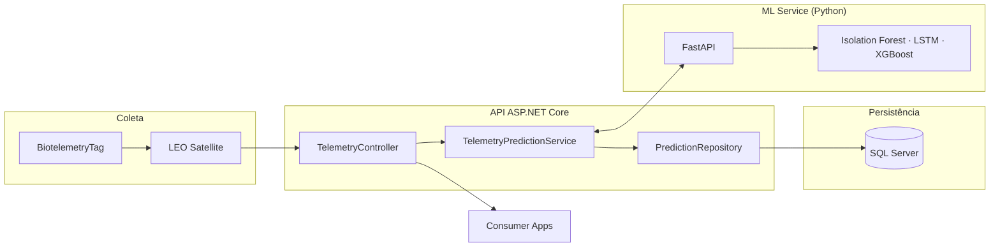
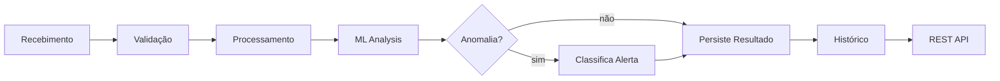
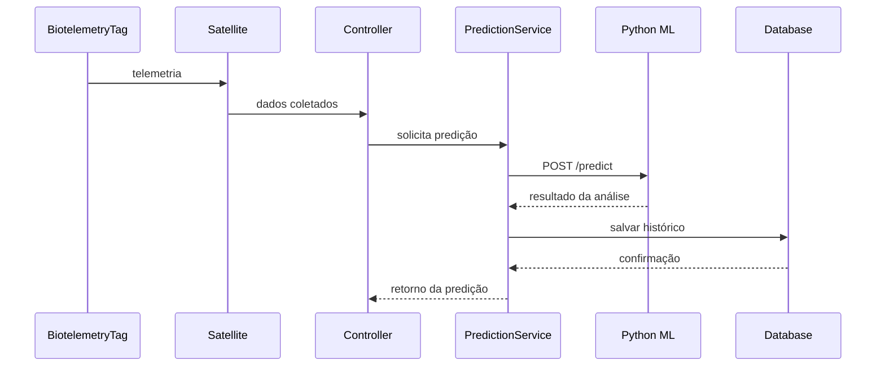

# 🛰️ Global Solution 2026
### Sistema Inteligente de Monitoramento de Fauna por Telemetria Espacial

---

## 👥 Integrantes

| Nome | RM |
|------|-----|
| Nome Completo | XXXXXXX |
| Nome Completo | XXXXXXX |
| Nome Completo | XXXXXXX |

---

## 📖 Sobre o Projeto

Dispositivos de biotelemetria acoplados aos animais transmitem dados fisiológicos e geográficos contínuos para satélites de baixa órbita (LEO). Esses dados chegam a uma API ASP.NET Core que os repassa a um serviço de Machine Learning em Python — responsável por detectar anomalias e prever eventos ambientais de risco. Os resultados ficam persistidos no SQL Server para rastreabilidade, histórico e suporte à tomada de decisão.

---

## 🎯 Objetivos

- Centralizar dados de telemetria animal
- Processar informações em tempo real
- Detectar padrões comportamentais anômalos
- Aplicar modelos de Machine Learning
- Gerar alertas preventivos
- Disponibilizar histórico de análises

---

## 🏗️ Arquitetura da Solução

Construída sobre SOA, WebServices, Programação Orientada a Objetos e Repository Pattern — cada camada tem responsabilidade única e se comunica via interfaces bem definidas.



---

## 🔄 Fluxo Operacional



---

## 🔁 Diagrama de Sequência



---

## 🧩 Diagrama de Classes

```mermaid
classDiagram
    class SpaceEquipment {
        <<abstract>>
        +Id
        +Name
        +TransmitDiagnostic()
    }

    class Satellite {
        +OrbitType
        +AltitudeKm
        +TransmitDiagnostic()
    }

    class BiotelemetryTag {
        +SpeciesId
        +HeartRate
        +Acceleration
        +TransmitDiagnostic()
    }

    class PredictionHistory {
        +SpeciesId
        +Probability
        +AlertLevel
        +AnalysisDate
    }

    class ITelemetryPredictionService {
        <<interface>>
    }

    class TelemetryPredictionService {
    }

    class IGenericRepository~T~ {
        <<interface>>
    }

    class GenericRepository~T~ {
    }

    SpaceEquipment <|-- Satellite
    SpaceEquipment <|-- BiotelemetryTag
    BiotelemetryTag --> PredictionHistory
    TelemetryPredictionService ..|> ITelemetryPredictionService
    GenericRepository ..|> IGenericRepository
    TelemetryPredictionService --> IGenericRepository
```



---

## 🚀 Tecnologias Utilizadas

| Camada | Tecnologias |
|--------|-------------|
| Backend | ASP.NET Core · C# · Swagger/OpenAPI · AutoMapper · Dependency Injection |
| Banco de dados | SQL Server · Entity Framework Core |
| Machine Learning | Python · FastAPI · Isolation Forest · LSTM · XGBoost |
| Integração | REST API · HttpClientFactory · SOA |

---

## 🧠 Conceitos de POO Aplicados

**Encapsulamento** — atributos das entidades protegidos, expostos apenas via propriedades e DTOs.

**Herança** — `SpaceEquipment` é a classe base abstrata; `Satellite` e `BiotelemetryTag` herdam e estendem seu comportamento.

**Polimorfismo** — `TransmitDiagnostic()` é implementado de forma distinta em cada equipamento, preservando a mesma assinatura.

**Abstração** — `SpaceEquipment` define o contrato comum; os detalhes de cada tipo ficam encapsulados nas subclasses.

---

## 🔌 Interfaces

- `IGenericRepository<T>` — operações de persistência
- `ITelemetryPredictionService` — processamento das predições

---

## 💉 Injeção de Dependência

Registrada via container nativo do ASP.NET Core:

- `GenericRepository`
- `TelemetryPredictionService`
- `HttpClientFactory`

---

## 📦 DTOs

- `TelemetryDTO`
- `SatelliteDTO`
- `SpaceEquipmentDTO`
- `BiotelemetryTagDTO`
- `PredictionResponseDTO`

---

## 🗄️ Banco de Dados

**PredictionHistory** — armazena espécie monitorada, coordenadas geográficas, frequência cardíaca, aceleração, tipo de anomalia, probabilidade, nível de alerta e data da análise.

**SpaceEquipment** — tabela base (TPH) com discriminator para os subtipos `Satellite` e `BiotelemetryTag`.

---

## 🛡️ Tratamento de Exceções

A exceção customizada `SpaceTelemetryException` centraliza o tratamento de falhas na API Python, erros de comunicação externa, falhas de processamento e exceções não mapeadas nas integrações.

---

## 🔗 Endpoints

### `POST /api/telemetry/predict`

Recebe dados de biotelemetria e retorna uma predição com nível de alerta.

```json
{
  "speciesId":    "ANIMAL-001",
  "latitude":     -23.5505,
  "longitude":    -46.6333,
  "acceleration": 8.5,
  "heartRate":    120
}
```

### `GET /api/telemetry/predictions`

Retorna o histórico completo de predições armazenadas no banco.

---

## 📂 Estrutura do Projeto

```
Controllers/
└── TelemetryController.cs

Services/
└── TelemetryPredictionService.cs

Repositories/
└── GenericRepository.cs

Interfaces/
├── IGenericRepository.cs
└── ITelemetryPredictionService.cs

Models/
├── SpaceEquipment.cs
├── Satellite.cs
├── BiotelemetryTag.cs
├── PredictionHistory.cs
└── Telemetry.cs

DTOs/
├── RequestDTOs/
└── ResponseDTOs/

Exceptions/
└── SpaceTelemetryException.cs

Data/
└── AppDbContext.cs
```

---

## ▶️ Como Executar

**1. Clone o repositório**
```bash
git clone URL_DO_REPOSITORIO
```

**2. Aplique as migrations**
```bash
dotnet ef database update
```

**3. Suba a aplicação**
```bash
dotnet run
```

**4. Acesse o Swagger**
```
https://localhost:[porta]/swagger
```

---

## 📸 Evidências de Execução

> Adicionar prints de: Swagger em execução · endpoints testados · banco populado · comunicação com a API Python · retornos JSON

---

## 🎥 Demonstração

[▶ Assistir no YouTube](https://youtu.be/5G9euYeWuxI)

---

## ✅ Conclusão

A solução demonstra a aplicação integrada de SOA, WebServices, Programação Orientada a Objetos e Machine Learning na construção de um sistema distribuído para monitoramento ambiental. A arquitetura proposta garante escalabilidade, rastreabilidade e processamento inteligente de dados — contribuindo para pesquisas ambientais e sistemas de alerta preventivo.
