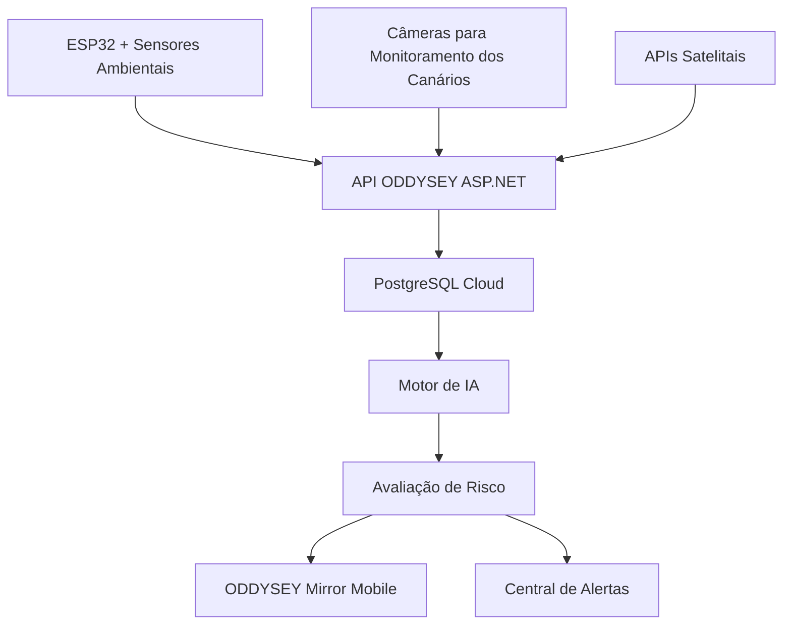
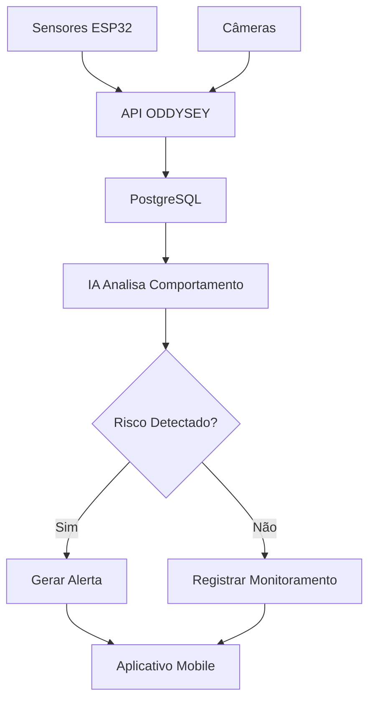
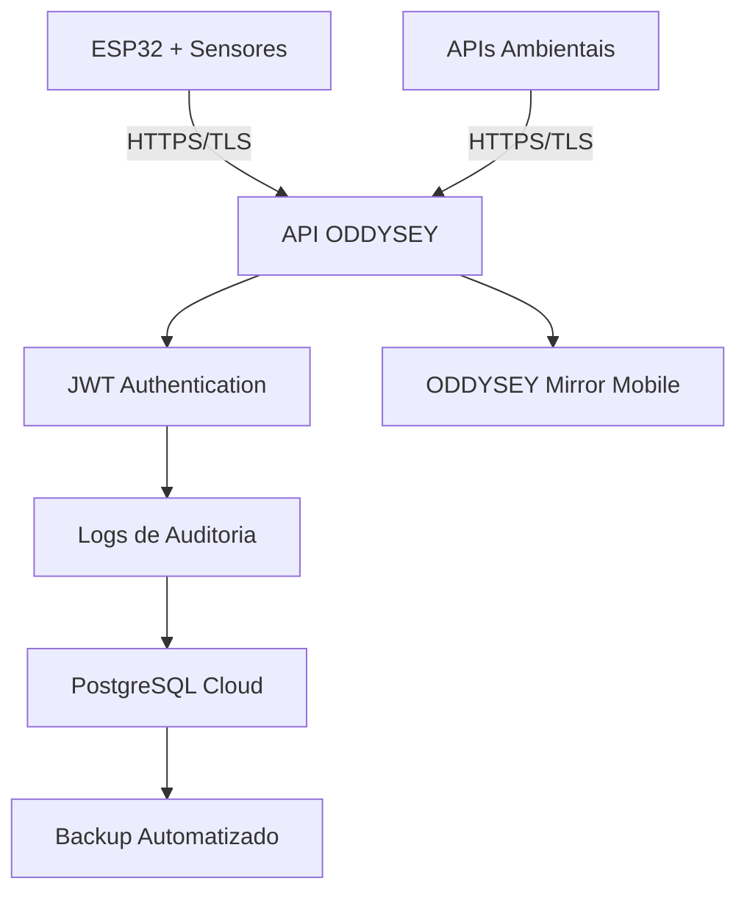

<p align="center">


</p>

<h1 align="center">🛰️ ODDYSEY</h1>

<p align="center">
<b>Plataforma Inteligente de Monitoramento Biológico, Ambiental e Espacial</b>
</p>

<p align="center">
Sistema desenvolvido para detecção preventiva de riscos ambientais utilizando Inteligência Artificial, Visão Computacional, Sensores IoT, Dados Satelitais e Monitoramento Comportamental de Canários.
</p>

---

# 👥 Integrantes

| Nome | RM |
|--------|--------|
| Nome Integrante | RMXXXXX |
| Nome Integrante | RMXXXXX |
| Nome Integrante | RMXXXXX |
| Nome Integrante | RMXXXXX |

---

# 🌎 Sobre o Projeto

O ODDYSEY foi desenvolvido para antecipar riscos ambientais antes que sensores tradicionais detectem níveis críticos de contaminação.

A solução combina:

- Inteligência Artificial
- Visão Computacional
- Sensores Ambientais
- ESP32
- Banco PostgreSQL Cloud
- APIs Satelitais
- Aplicativo Mobile

Além da análise dos sensores, o sistema monitora alterações comportamentais em canários, permitindo identificar possíveis ameaças ambientais em estágio inicial.

Essas informações são processadas por algoritmos inteligentes que classificam o nível de risco e geram alertas preventivos.

---

# 🎯 Objetivos

| Objetivo | Descrição |
|-----------|-----------|
| 🌱 Monitoramento Ambiental | Coletar dados ambientais continuamente |
| 🤖 Inteligência Artificial | Detectar padrões e anomalias |
| 🚨 Alertas Preventivos | Antecipar riscos ambientais |
| 🛰️ Integração Espacial | Utilizar informações provenientes de satélites |
| 🔐 Segurança Digital | Garantir integridade e disponibilidade dos dados |

---

# 🏗️ Arquitetura da Solução



---

# 🔄 Fluxo Operacional



---

# 🛡️ Metodologia de Análise de Riscos

Foi utilizada a metodologia STRIDE Simplificada, amplamente empregada na análise de ameaças em sistemas distribuídos, aplicações web, IoT e ambientes em nuvem.

## Categorias Utilizadas

| Categoria | Descrição |
|------------|------------|
| Spoofing | Falsificação de identidade |
| Tampering | Alteração indevida de dados |
| Repudiation | Negação de ações |
| Information Disclosure | Vazamento de informações |
| Denial of Service | Indisponibilidade |
| Elevation of Privilege | Escalação de privilégios |

---

# ⚠️ Ativos Críticos, Ameaças e Impactos

| Ativo | Ameaça | Categoria STRIDE | Impacto |
|---------|---------|---------|---------|
| API de Telemetria | Dados falsificados | Spoofing | Alertas incorretos |
| PostgreSQL | Alteração de registros | Tampering | Decisões equivocadas |
| PostgreSQL | Vazamento de dados | Information Disclosure | Exposição de informações |
| ESP32 | Interceptação da comunicação | Information Disclosure | Captura de dados |
| Aplicativo Mobile | Acesso indevido | Elevation of Privilege | Uso não autorizado |
| API Backend | Ataque DDoS | Denial of Service | Sistema indisponível |
| PostgreSQL | Exclusão de registros | Tampering | Perda de histórico |
| APIs Satelitais | Indisponibilidade | Denial of Service | Redução da análise |

---

# 🔒 Controles de Segurança Implementados

## 1. HTTPS/TLS

### Aplicação

- ESP32 → API
- Mobile → API
- API → Serviços Externos

### Benefícios

- Criptografia dos dados
- Proteção contra interceptação
- Mitigação de ataques Man-in-the-Middle

---

## 2. Autenticação JWT

### Aplicação

- Backend ASP.NET

### Benefícios

- Controle de acesso
- Identificação de usuários
- Rastreabilidade

---

## 3. Backup Automatizado

### Aplicação

- PostgreSQL Cloud

### Benefícios

- Recuperação de dados
- Continuidade operacional
- Proteção contra perda de informações

---

## 4. Logs de Auditoria

### Aplicação

- API ODDYSEY

### Benefícios

- Monitoramento
- Auditoria
- Investigação de incidentes

---

# 🔐 Arquitetura de Segurança



---

# 💻 Implementação Prática

A implementação prática escolhida foi o monitoramento através de logs utilizando o sistema nativo do ASP.NET Core.

## Exemplo

```csharp
[HttpPost]
public IActionResult ReceberTelemetria(TelemetriaDTO dto)
{
    _logger.LogInformation(
        "Nova telemetria recebida do sensor {SensorId}",
        dto.SensorId
    );

    return Ok();
}
```

---

# 📋 Evidências

As evidências utilizadas para validação da implementação encontram-se na pasta:

```text
/evidencias
```

## Evidência 1

Código implementado no Controller.

Arquivo:

```text
codigo/TelemetriaController.cs
```

## Evidência 2

API em execução.

Print esperado:

```text
Terminal executando o ASP.NET Core.
```

## Evidência 3

Logs registrados.

Exemplo:

```text
info: Nova telemetria recebida do sensor ESP32-001

info: Nova telemetria recebida do sensor ESP32-002
```

## Evidência 4

Teste realizado via Postman.

Resultado:

```text
HTTP 200 OK
```

---

# 📂 Estrutura do Projeto

```text
GS-Cybersecurity-Odyssey

├── README.md

├── evidencias
│   ├── log-api.png
│   ├── terminal-log.png
│   ├── postman-request.png

├── codigo
│   └── TelemetriaController.cs

└── documento
    └── GS_Cybersecurity_ODDYSEY.pdf
```

---

# ▶️ Como Executar

## Restaurar Dependências

```bash
dotnet restore
```

## Executar Projeto

```bash
dotnet run
```

## Acessar Swagger

```text
https://localhost:porta/swagger
```

---

# 🌎 Contribuição para os ODS

## ODS 3 — Saúde e Bem-Estar

Detecção preventiva de riscos ambientais que possam impactar a população.

## ODS 11 — Cidades e Comunidades Sustentáveis

Melhoria da resposta a incidentes ambientais.

## ODS 13 — Ação Contra a Mudança Global do Clima

Monitoramento de queimadas e alterações ambientais.

## ODS 15 — Vida Terrestre

Proteção dos ecossistemas através da identificação precoce de ameaças.

---

# 🛰️ Relação com o Ecossistema Espacial

A arquitetura do ODDYSEY foi concebida considerando futuras aplicações em:

- Bases Lunares
- Habitats Espaciais
- Missões de Longa Duração
- Sistemas de Suporte à Vida

Em ambientes espaciais, falhas ambientais podem comprometer diretamente a sobrevivência humana.

Os controles de segurança implementados garantem:

- Integridade dos dados ambientais
- Disponibilidade dos sistemas críticos
- Rastreabilidade dos eventos
- Proteção contra acessos indevidos

---

# 🚀 Evoluções Futuras

- [ ] Machine Learning avançado para previsão de eventos ambientais
- [ ] Dashboard Web
- [ ] Notificações em tempo real
- [ ] Integração com novos sensores IoT
- [ ] Monitoramento geoespacial avançado
- [ ] Integração com satélites de baixa órbita

---

<p align="center">

<b>FIAP • Global Solution 2026 • Engenharia de Software • Cibersegurança</b>

</p>
````
