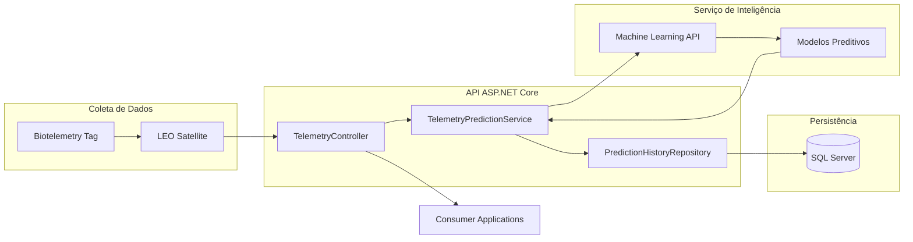
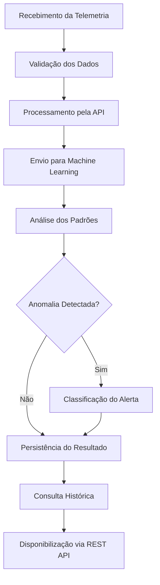
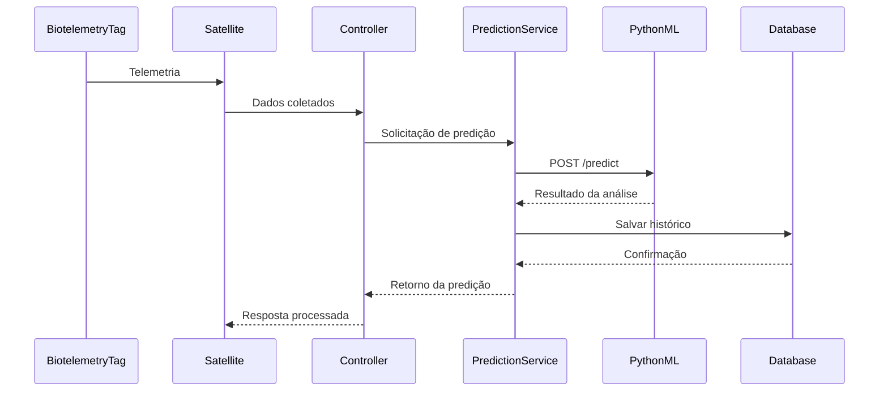
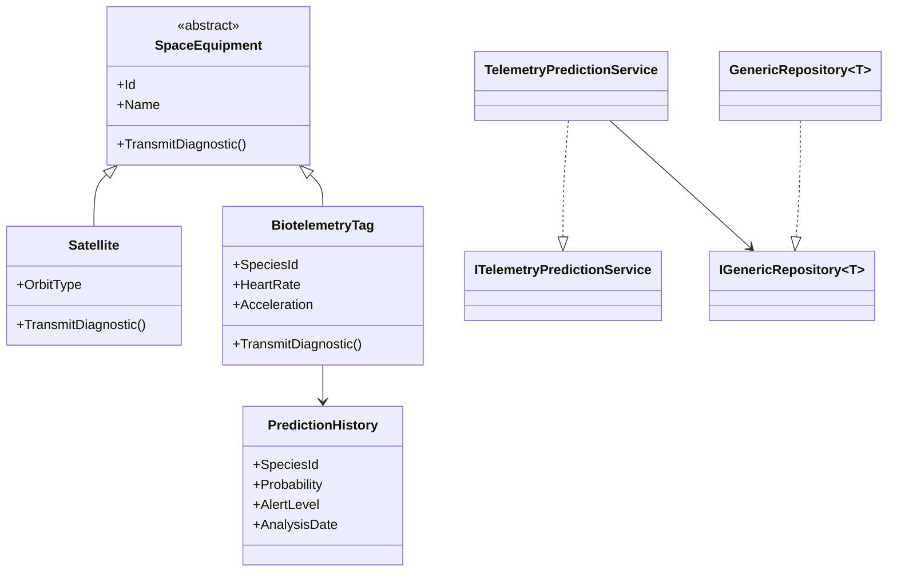

# 🛰️ Global Solution 2026
## Sistema Inteligente de Monitoramento de Fauna por Telemetria Espacial

---

# 👥 Integrantes

| Nome | RM |
|--------|--------|
| Nome Completo | XXXXXXX |
| Nome Completo | XXXXXXX |
| Nome Completo | XXXXXXX |

---

# 📖 Sobre o Projeto

O Sistema Inteligente de Monitoramento de Fauna por Telemetria Espacial foi desenvolvido para auxiliar pesquisadores e órgãos ambientais na identificação precoce de alterações comportamentais em espécies monitoradas.

A solução utiliza dispositivos de biotelemetria acoplados aos animais e satélites de baixa órbita (LEO) para coleta contínua de dados fisiológicos e geográficos.

Os dados coletados são processados por um serviço de Machine Learning responsável por identificar anomalias e prever possíveis eventos ambientais de risco.

As previsões são armazenadas em banco de dados SQL Server para rastreabilidade, histórico e suporte à tomada de decisão.

---

# 🎯 Objetivos

- Centralizar dados de telemetria animal
- Processar informações em tempo real
- Detectar padrões comportamentais anômalos
- Aplicar modelos de Machine Learning
- Gerar alertas preventivos
- Disponibilizar histórico de análises

---

# 🏗️ Arquitetura da Solução

A solução foi construída utilizando princípios de SOA (Service-Oriented Architecture), WebServices, Programação Orientada a Objetos e Repository Pattern.

## Diagrama de Arquitetura



---

# 🔄 Fluxo Operacional



---

# 🔁 Diagrama de Sequência



---

# 🧩 Diagrama de Classes



---

# 🚀 Tecnologias Utilizadas

## Backend

- ASP.NET Core
- C#
- Swagger/OpenAPI
- AutoMapper
- Dependency Injection

## Banco de Dados

- SQL Server
- Entity Framework Core

## Integrações

- REST API
- HttpClientFactory
- Serviço Externo de Machine Learning

## Machine Learning

- Python
- FastAPI
- Isolation Forest
- LSTM
- XGBoost

---

# 🧠 Conceitos de Programação Aplicados

## Encapsulamento

Aplicado na modelagem das entidades e proteção dos atributos.

## Herança

Classe Base:

```csharp
SpaceEquipment
```

Classes Derivadas:

```csharp
Satellite
BiotelemetryTag
```

## Polimorfismo

Método:

```csharp
TransmitDiagnostic()
```

Implementado de forma distinta para cada equipamento.

## Abstração

Classe abstrata:

```csharp
SpaceEquipment
```

---

# 🔌 Interfaces

## IGenericRepository<T>

Responsável pelas operações de persistência.

## ITelemetryPredictionService

Responsável pelo processamento das previsões.

---

# 💉 Injeção de Dependência

Registrada através do container nativo do ASP.NET Core.

Serviços:

- GenericRepository
- TelemetryPredictionService
- HttpClientFactory

---

# 📦 DTOs

- TelemetryDTO
- SatelliteDTO
- SpaceEquipmentDTO
- BiotelemetryTagDTO
- PredictionResponseDTO

---

# 🗄️ Banco de Dados

## PredictionHistory

Armazena:

- Espécie monitorada
- Coordenadas geográficas
- Frequência cardíaca
- Aceleração
- Tipo de anomalia
- Probabilidade
- Nível de alerta
- Data da análise

## SpaceEquipment

Tabela base para equipamentos espaciais.

Subtipos:

- Satellite
- BiotelemetryTag

---

# 🛡️ Tratamento de Exceções

Exceção customizada:

```csharp
SpaceTelemetryException
```

Responsável pelo tratamento de:

- Falhas na API Python
- Falhas de comunicação externa
- Erros de processamento
- Exceções de integração

---

# 🔗 Endpoints

## Gerar Predição

```http
POST /api/telemetry/predict
```

### Payload

```json
{
  "speciesId": "ANIMAL-001",
  "latitude": -23.5505,
  "longitude": -46.6333,
  "acceleration": 8.5,
  "heartRate": 120
}
```

## Consultar Histórico

```http
GET /api/telemetry/predictions
```

---

# 📂 Estrutura do Projeto

```text
Controllers
├── TelemetryController

Services
├── TelemetryPredictionService

Repositories
├── GenericRepository

Interfaces
├── IGenericRepository
├── ITelemetryPredictionService

Models
├── SpaceEquipment
├── Satellite
├── BiotelemetryTag
├── PredictionHistory
├── Telemetry

DTOs
├── RequestDTOs
├── ResponseDTOs

Exceptions
├── SpaceTelemetryException

Profiles
├── TelemetryProfile

Data
├── AppDbContext
```

---

# ▶️ Como Executar

## Clonar Repositório

```bash
git clone URL_DO_REPOSITORIO
```

## Atualizar Banco

```bash
dotnet ef database update
```

## Executar Aplicação

```bash
dotnet run
```

## Swagger

```text
https://localhost:[porta]/swagger
```

---

# 📸 Evidências de Execução

Adicionar:

- Swagger em execução
- Endpoints testados
- Banco populado
- Comunicação com API Python
- Retornos JSON

---

# 🎥 Demonstração

https://youtu.be/5G9euYeWuxI

---

# ✅ Conclusão

A solução demonstra a aplicação integrada dos conceitos de SOA, WebServices, Programação Orientada a Objetos e Machine Learning na construção de um sistema distribuído para monitoramento ambiental.

A arquitetura proposta possibilita escalabilidade, rastreabilidade e processamento inteligente de dados, contribuindo para pesquisas ambientais e sistemas de alerta preventivo.
